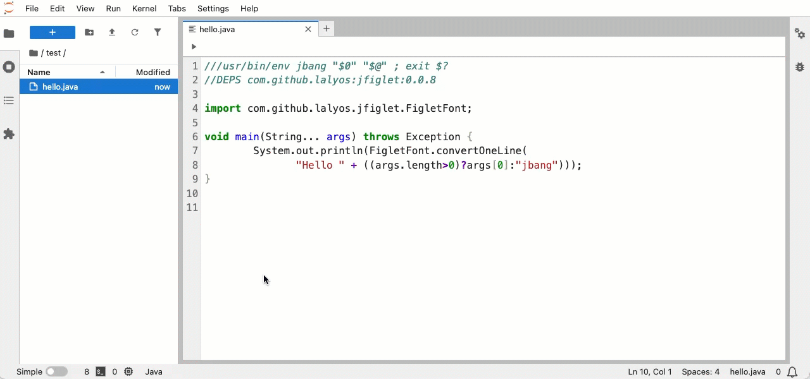

# Jupyter JBang Runner

A JupyterLab extension that adds a run button to `.java` and `.jsh` files, allowing you to execute them directly with [jbang](https://www.jbang.dev/).




## Features

- 🚀 **Run Button**: Adds a run button (▶️) to the toolbar of `.java` and `.jsh` files
- 💾 **Auto-save**: Automatically saves files before running to ensure latest code is executed
- 🔄 **Terminal Reuse**: Reuses existing terminals per file to avoid clutter
- 📺 **Terminal Integration**: Executes files using jbang in an integrated terminal
- 🎯 **Smart Detection**: Only shows the run button for supported file types (`.java`, `.jsh`)

## Prerequisites

- JupyterLab 4.0+
- [jbang](https://www.jbang.dev/) installed and available in PATH
- Node.js and npm (for development)
- Python 3.8+ (for installation)

## Installation

### For Users

```bash
pip install jbang-jupyter-runner
```

### For Development

**Detailed guide**: See [CONTRIBUTING.md](./docs/DEVELOPMENT.md)

## Usage

1. **Open a Java or JSH file**: Open any `.java` or `.jsh` file in JupyterLab
2. **Click the Run Button**: Look for the run button (▶️) in the file editor toolbar
3. **View Output**: The file will be executed with jbang in a terminal tab

### Example Files

Create a simple Java file to test:

**HelloWorld.java**

```java
///usr/bin/env jbang "$0" "$@" ; exit $?

public class HelloWorld {
    public static void main(String[] args) {
        System.out.println("Hello from JBang!");
    }
}
```

Or a JShell script:

**example.jsh**

```java
///usr/bin/env jbang "$0" "$@" ; exit $?
//DEPS org.apache.commons:commons-lang3:3.12.0

import org.apache.commons.lang3.StringUtils;

System.out.println(StringUtils.capitalize("hello world"));
```

## How It Works

### Terminal Management

The extension creates one terminal per file:

- **First run**: Creates a new terminal named `jbang-FileName.java`
- **Subsequent runs**: Reuses the same terminal, just sends a new command
- **Different files**: Each file gets its own dedicated terminal

### Auto-save Feature

Before executing, the extension:

1. Checks if the file has unsaved changes
2. Automatically saves the file if needed
3. Then runs the jbang command with the latest code

This ensures you always run the current version of your code!

## Development

### Project Structure

```
jbang-jupyter-runner/
├── src/                    # TypeScript source code
│   ├── index.ts           # Extension entry point
│   └── runButton.ts       # Run button implementation
├── style/                  # CSS styles
├── jbang_jupyter_runner/  # Python package
│   ├── __init__.py
│   ├── _version.py
│   └── labextension/      # Built extension (generated)
├── lib/                    # Compiled JavaScript (generated)
├── package.json           # npm configuration
├── pyproject.toml         # Python package configuration
└── tsconfig.json          # TypeScript configuration
```

## License

MIT License - see LICENSE file for details
